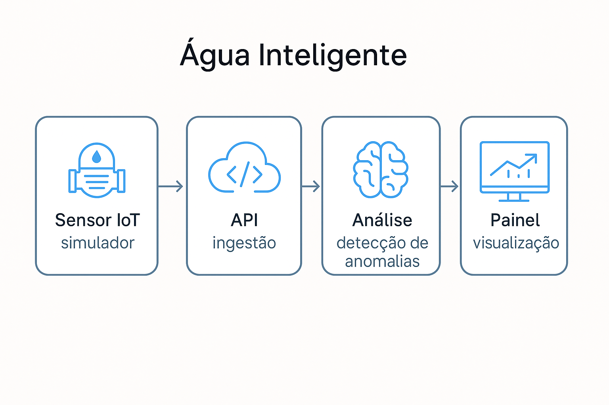

# 💧 Projeto Integrador IV — Água Inteligente

**Monitoramento de vazão em tempo real com FastAPI + Streamlit + Analytics**



Bem-vindo ao projeto da **Turma 001 – UNIVESP (Ciência de Dados)**.
O sistema acompanha a **vazão de água em tempo real**, detecta **anomalias** de consumo e exibe tudo em um **dashboard web** simples de usar.

Este guia explica como **qualquer integrante do grupo** consegue rodar o sistema localmente e, opcionalmente, gerar um **executável (.exe)** para facilitar a visualização.

---

## ✅ Pré-requisitos

No Windows, verifique se você tem:

* ✔ **VS Code** instalado
* ✔ **Python 3.10+** instalado
* ✔ **Conta no GitHub**
* ✔ **Internet funcionando** 👍

Se tudo certo, prossiga.

---

## 🚀 Instalação rápida (modo integrante do grupo)

> Siga os passos na **ordem**.

### 1) Baixar o projeto

Abra o **VS Code** → **View > Terminal** e rode:

```bash
git clone https://github.com/DRP05-P-I-UNIVESP-Comp-IV-Turma-001/agua-inteligente.git
cd agua-inteligente
```

### 2) Criar e ativar o ambiente virtual

```bash
python -m venv .venv
.\.venv\Scripts\Activate.ps1
```

Se aparecer erro de permissão, rode:

```bash
Set-ExecutionPolicy -Scope Process -ExecutionPolicy Bypass
```

e ative de novo o venv.

### 3) Instalar dependências

```bash
pip install -r requirements.txt
```

### 4) Rodar o dashboard (com backend automático via launcher)

Opção simples para visualização:

```bash
python launcher.py
```

O **launcher**:

1. Sobe o **backend FastAPI** local ([http://127.0.0.1:8000](http://127.0.0.1:8000))
2. Aguarda o **/health** responder
3. Abre o **Dashboard** no navegador ([http://localhost:8501](http://localhost:8501))
4. Ao fechar o Dashboard, encerra o backend

> Dica: também é possível rodar manualmente (modo desenvolvedor), conforme seção abaixo.

---

## 🧩 Estrutura do projeto

```
agua_inteligente/
├─ edge/               # Simulador de sensores
├─ ingestion/          # API FastAPI + SQLite (data.db)
│  └─ main.py
├─ analytics/          # Detecção de anomalias (z-score / IQR)
│  ├─ processing.py
│  └─ test_processing.py
├─ dashboard/          # Interface Streamlit
│  ├─ app.py
│  └─ config.py        # API_BASE e TIMEZONE (variáveis)
├─ docs/               # Evidências e documentação
├─ launcher.py         # Lançador (usado no .exe e para iniciar tudo)
└─ requirements.txt
```

---

## 🧠 Módulo Analytics: como funciona

O dashboard permite escolher o **método de detecção**:

* **Z-score (padrão):** estável para séries regulares
* **IQR:** mais sensível a picos pontuais

Parâmetros ajustáveis na barra lateral:

* **Tamanho da janela** (rolling window)
* **Limiar Z** ou **Fator IQR**
* **Janela temporal** e **limite de registros**

Endpoint para consumo externo:

```
GET /analytics/anomalies
```

Retorna por anomalia:

```json
{
  "meter_code": "SETOR-A-01",
  "ts": "2025-11-02T16:05:00Z",
  "flow_lpm": 22.15,
  "zscore": 3.41,
  "rolling_mean": 15.80,
  "rolling_std": 1.86,
  "is_anomaly": true
}
```

---

## 👨‍💻 Modo desenvolvedor (rodar serviços separadamente)

### A) Backend FastAPI

```bash
uvicorn ingestion.main:app --reload
```

Teste no navegador:

* `http://127.0.0.1:8000/health`
* `http://127.0.0.1:8000/readings`
* `http://127.0.0.1:8000/analytics/anomalies`

### B) Dashboard Streamlit

Em outro terminal (com o venv ativo):

```bash
streamlit run dashboard/app.py
```

Acesse: `http://localhost:8501`

### C) Variáveis de ambiente opcionais do Dashboard

No Windows PowerShell:

```powershell
$env:AGUA_API_BASE="http://127.0.0.1:8000"
$env:AGUA_TZ="America/Sao_Paulo"
```

O arquivo `dashboard/config.py` lê:

```python
API_BASE = os.getenv("AGUA_API_BASE", "http://127.0.0.1:8000")
TIMEZONE = os.getenv("AGUA_TZ", "America/Sao_Paulo")
```

---

## 🌐 Acessar de outro dispositivo na mesma rede

O Streamlit mostra um **Network URL**. Exemplo:

```
http://192.168.15.8:8501
```

Abra no celular/notebook da mesma rede Wi-Fi para visualizar o painel.

---

## 🖥️ Gerar executável (.exe) com PyInstaller

> Use esta opção quando quiser distribuir um arquivo único para o time testar o sistema sem precisar rodar comandos.

1. Instale o PyInstaller:

```bash
pip install pyinstaller
```

2. Gere o executável a partir do `launcher.py`:

```bash
pyinstaller --noconfirm --onefile --console ^
  --name AguaInteligente ^
  --add-data "dashboard;dashboard" ^
  --add-data "ingestion;ingestion" ^
  --add-data "analytics;analytics" ^
  --collect-data "pydantic" ^
  --collect-data "starlette" ^
  --collect-data "uvicorn" ^
  --collect-data "pandas" ^
  --collect-data "numpy" ^
  launcher.py
```

3. Execute

* O `.exe` ficará em `dist\AguaInteligente.exe`
* Dê **duplo clique** para abrir.
* Ele iniciará o backend, aguardará o `/health` e abrirá o Dashboard no navegador.
* Ao fechar o Dashboard, o backend é encerrado.

> Observações: antivírus corporativos podem sinalizar executáveis “one-file”. Se acontecer, compartilhe internamente por canal confiável ou use o lançador `.bat`.

---

## 🔍 O que você verá no Dashboard

* **KPIs**: sensores ativos, sensores únicos, vazão média, máxima e total de leituras
* **Gráfico temporal** de vazão
* **Alertas Recentes** com as anomalias mais novas
* **Status dos Hidrômetros**:

  * 🔺 possui anomalias
  * ✅ normal

---

## 🧾 Roadmap (próximas etapas)

* [x] Dashboard básico com KPIs e gráficos
* [x] Backend FastAPI com banco SQLite
* [x] Detecção de anomalias (Z-score e IQR)
* [x] Endpoint `/analytics/anomalies` integrado
* [x] Lançador e empacotamento `.exe`
* [ ] Métricas adicionais por setor e sazonalidade
* [ ] Alertas visuais no gráfico (pontos em destaque)
* [ ] Exportação de relatórios (CSV/PDF)
* [ ] Integração com sensores reais no módulo `edge/`

---

## 🧯 Ajuda rápida

| Situação                         | O que fazer                                                                                         |
| -------------------------------- | --------------------------------------------------------------------------------------------------- |
| O painel não abre                | Verifique se o backend responde em `/health`. Se usou o `launcher.py`, ele aguarda automaticamente. |
| Erro de permissão ao ativar venv | Rode `Set-ExecutionPolicy -Scope Process -ExecutionPolicy Bypass` e ative novamente.                |
| Tabela não aparece               | Aguarde o simulador/ingestão gerar leituras.                                                        |
| Aviso “use_container_width”      | Já foi corrigido para `width='stretch'`. Atualize o arquivo se necessário.                          |

Se travar, feche os terminais e reabra o VS Code. Persistindo, avise no grupo. 😅

---

## 🤝 Equipe

* Magno Bruno Camargo Proença
* Mauro Sergio Bouwman Leão
* Bruno Luiz Silva Marchi
* Beatriz Aiello Yazbek


